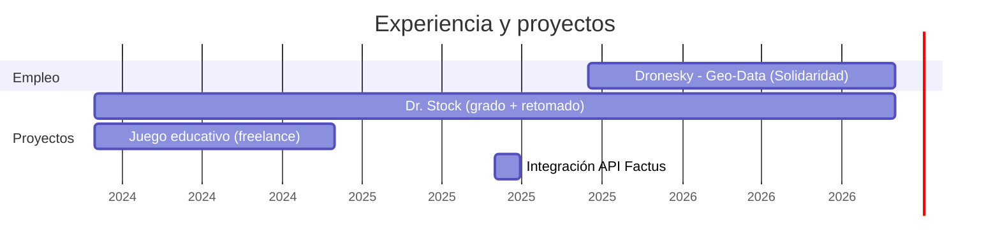

  
  
  

## 👋 Sobre mí

Desarrollador Fullstack y Data Engineer enfocado en llevar datos y aplicaciones desde la idea hasta producción.

En mi paso más reciente por **Dronesky** (proyecto para Solidaridad) diseñé y mantuve un pipeline ETL en Python orquestado con Apache Airflow para el procesamiento de datos geoespaciales, siendo responsable de **más del 80% del código** del proyecto. Ahí mismo rediseñé un proceso de carga masiva que pasó de tomar horas a minutos — lo cuento más abajo 👇.

Antes de eso construí aplicaciones de punta a punta: un sistema de inventarios con Laravel + Angular, integración de facturación electrónica con la API de Factus, y una plataforma educativa interactiva para niños.

Actualmente avanzando hacia el **5to semestre de Ingeniería de Software**. Java ☕ fue mi primer lenguaje y sigue siendo el que más disfruto escribir, aunque hoy me muevo cómodo entre Python, Angular y Spring Boot. Fuera del código, practico Karate desde hace 6 años 🥋.

---

## 🧰 Stack tecnológico

| Área | Tecnologías |
|---|---|
| **Frontend** |  |
| **Backend** |  |
| **Datos & Cloud** |  |
| **Herramientas** |  |

  
  
  
  
  

---

## ⚡ De 2 horas a 3-4 minutos: optimizando una carga masiva

En Geo-Data heredé un script de Selenium que subía informes en PDF ubicando cada uno por ID mediante **paginación manual y en orden aleatorio** — un registro podía estar en la página 1 o en la 400. Para un lote de apenas 5 archivos, el proceso completo (incluyendo arranque del navegador e inicio de sesión) tardaba cerca de **2 horas**.

Lo rediseñé usando **endpoints REST directos** en lugar de navegación por páginas, y lo integré como un DAG propio dentro del pipeline de Airflow. El mismo lote pasó a tomar **3-4 minutos**, y la solución escaló sin problema a producción con más de **1.000 archivos**.

---

## 📈 Línea de tiempo

---

## 📌 Proyectos destacados

**🗂️ Dr. Stock — Sistema de Gestión de Inventarios**
Sistema web de inventarios con autenticación, control de productos y stock en tiempo real.
`Laravel` `MySQL` `Angular 18` `Bootstrap`
🔗 [Demo en vivo](https://dr-stock-gules.vercel.app/auth) · Proyecto de grado, retomado — marzo 2024 – agosto 2026

**🧾 Integración API Factus**
Facturación electrónica automatizada dentro de una aplicación Angular.
`Angular` `API REST`
📅 Junio 2025

**🎮 Juego Educativo en Angular**
Plataforma interactiva de aprendizaje para niños de 4 a 10 años sobre diseño y estructura de computadores.
`Angular`
📅 Marzo – noviembre 2024 (freelance)

---

## 🎓 Educación

**Ingeniería de Software** — Fundación Escuela Tecnológica de Neiva (FET), Rivera-Huila — *en curso, 5to semestre*
Ciclo propedéutico: Tecnología en Desarrollo de Sistemas de Información y Redes (2026) · Técnico Profesional en Soporte de Sistemas Informáticos y Redes (2025)

---

## 📊 Actividad en GitHub

  
  

---

📫 **¿Hablamos?** [LinkedIn](https://www.linkedin.com/in/juan-jose-valbuena-camacho-848549278) · [Email](mailto:Juanjosecodes24@gmail.com)

