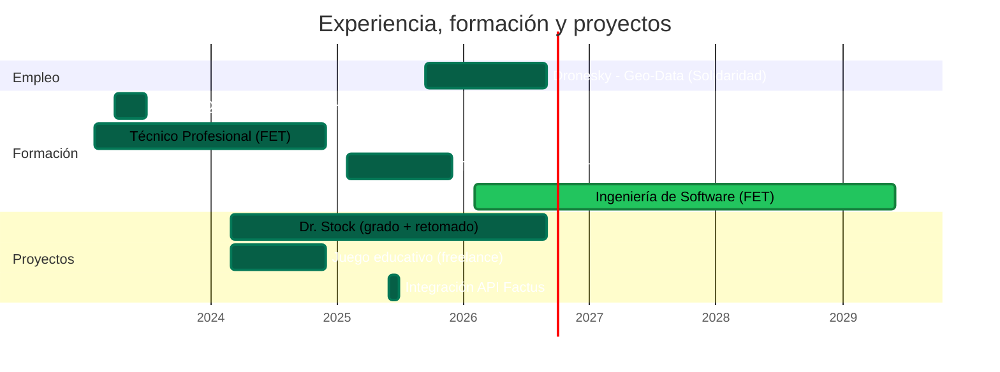

  
  
  

## 👋 Sobre mí

Soy Juan, desarrollador Fullstack y Data Engineer. Me gusta trabajar en proyectos donde los datos y el código se cruzan — llevar algo desde una idea hasta que corre en producción.

He trabajado tanto del lado de datos (pipelines, automatización, nube) como construyendo aplicaciones completas de punta a punta: un sistema de inventarios, facturación electrónica, una plataforma educativa para niños. Java sigue siendo mi lenguaje preferido, aunque me muevo cómodo en varios más.

Actualmente voy en el **8vo semestre de Ingeniería de Software** en la FET. Fuera del código, practico Karate desde hace 8 años 🥋 — la misma disciplina de repetir hasta que algo funcione bien la aplico aprendiendo tecnología nueva.

---

## 🧰 Stack tecnológico

| Área | Tecnologías |
|---|---|
| **Lenguajes** |  |
| **Frontend** |  |
| **Backend** |  |
| **Datos & Cloud** |  |
| **Herramientas** |  |

  
  
  
  
  

---

## 💼 Experiencia

**Ingeniería de Datos y Automatización Cloud — Dronesky** (proyecto para Solidaridad)
*Septiembre 2025 – Agosto 2026*

Diseñé y mantuve un pipeline ETL en Python orquestado con Apache Airflow para el procesamiento de datos geoespaciales, siendo responsable de **más del 80% del código** del proyecto.

El flujo completo arrancaba con la carga de datos desde **Google Drive hacia S3**, seguía por varias etapas de **ETL** — generando informes en cada paso intermedio — y cerraba con la carga de los resultados a **PostGIS** para el análisis geoespacial. Ahí también migré los scripts de **Selenium** que subían esos informes, integrándolos como tareas propias dentro del pipeline. Sobre AWS trabajé de punta a punta: **Glue** para las transformaciones, **Athena** para consultas, **Lambda, ECS y EC2** para cómputo, **IAM y Secrets Manager** para el control de acceso, y **CloudFormation** para la infraestructura como código — todo administrado también vía **AWS CLI**.

---

## ⚡ De 2 horas a 3-4 minutos: optimizando una carga masiva

En Geo-Data heredé un script de Selenium que subía informes en PDF ubicando cada uno por ID mediante **paginación manual y en orden aleatorio** — un registro podía estar en la página 1 o en la 400. Para un lote de apenas 5 archivos, el proceso completo (incluyendo arranque del navegador e inicio de sesión) tardaba cerca de **2 horas**.

Lo rediseñé usando **endpoints REST directos** en lugar de navegación por páginas, y lo integré como un DAG propio dentro del pipeline de Airflow. El mismo lote pasó a tomar **3-4 minutos**, y la solución escaló sin problema a producción con más de **1.000 archivos**.

---

## 📈 Línea de tiempo

---

## 📌 Proyectos destacados

**🗂️ Dr. Stock — Sistema de Gestión de Inventarios**
Sistema web de inventarios con autenticación, control de productos y stock en tiempo real.
`Laravel` `MySQL` `Angular 18` `Bootstrap`
🔗 [Demo en vivo](https://dr-stock-gules.vercel.app/auth) · Proyecto de grado, retomado — marzo 2024 – agosto 2026

**🧾 Integración API Factus**
Facturación electrónica automatizada dentro de una aplicación Angular.
`Angular` `API REST`
📅 Junio 2025

**🎮 Juego Educativo en Angular**
Plataforma interactiva de aprendizaje para niños de 4 a 10 años sobre diseño y estructura de computadores.
`Angular`
📅 Marzo – noviembre 2024 (freelance)

---

## 🎓 Educación

**Ingeniería de Software** — Fundación Escuela Tecnológica de Neiva (FET), Rivera-Huila — *en curso, 8vo semestre*
Ciclo propedéutico: Tecnología en Desarrollo de Sistemas de Información y Redes (2026) · Técnico Profesional en Soporte de Sistemas Informáticos y Redes (2025)

---

📫 **¿Hablamos?** [LinkedIn](https://www.linkedin.com/in/juan-jose-valbuena-camacho-848549278) · [Email](mailto:Juanjosecodes24@gmail.com)

