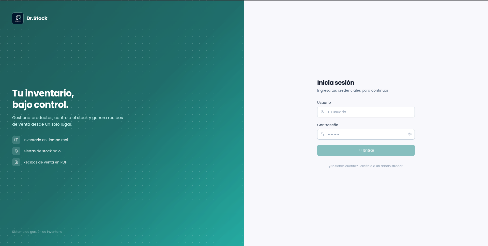
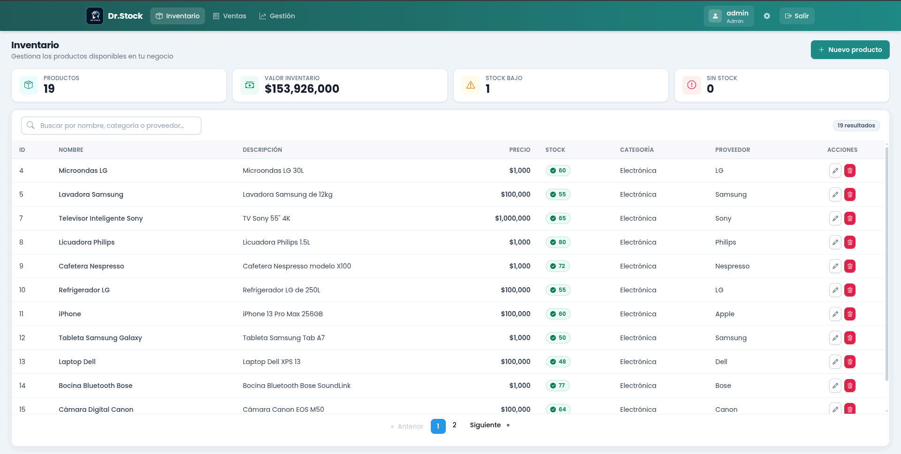
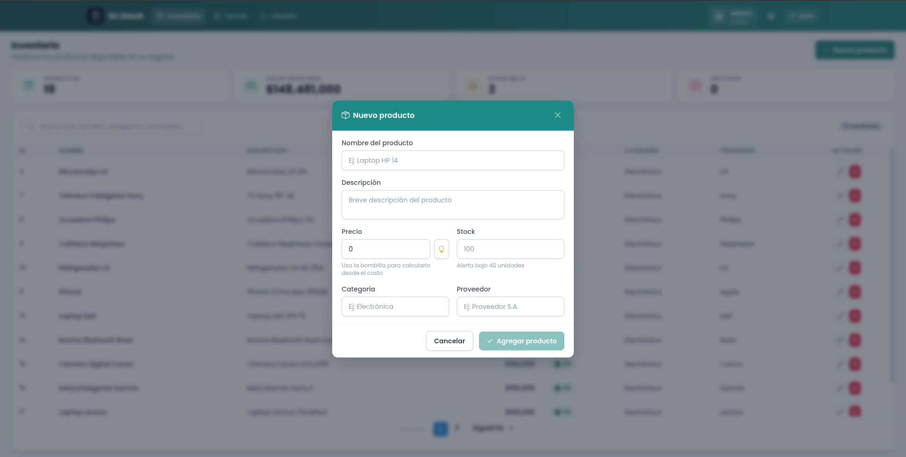
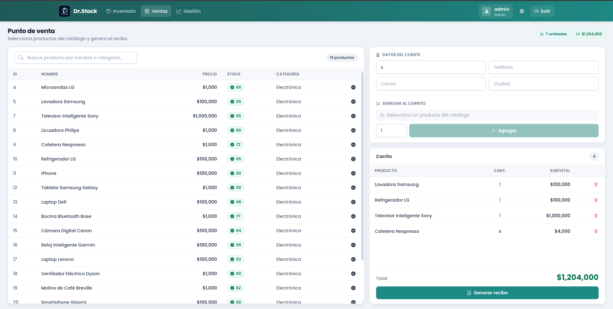
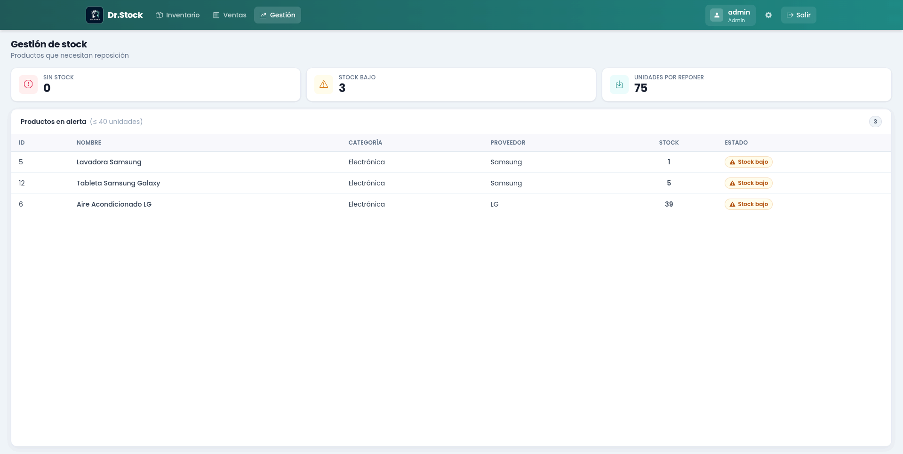
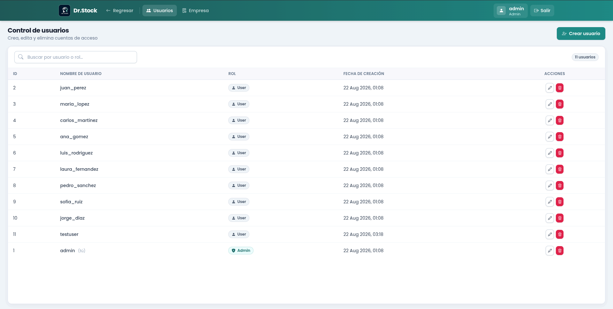
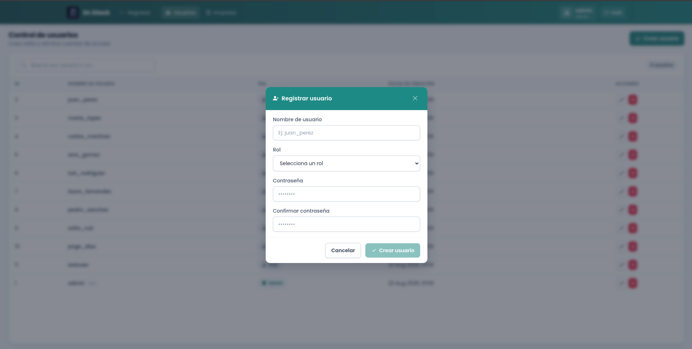
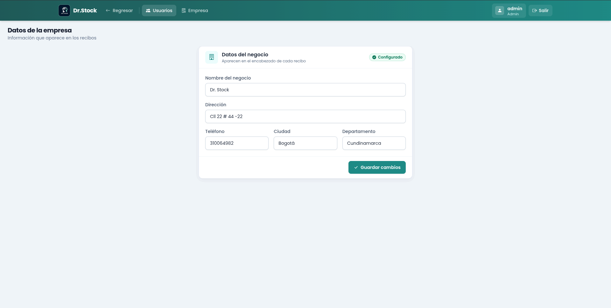

[← Volver al perfil](README.md)

# Dr.Stock

Sistema de gestión de inventario y punto de venta para pequeños negocios. Permite
llevar el control de productos y stock, registrar ventas generando el recibo en
PDF, alertar sobre productos por reponer y administrar los usuarios que acceden
al sistema.

**Stack:** Angular 17 + Tailwind · Spring Boot 3.3 + Java 17 · PostgreSQL 16 · Docker

---

# La aplicación

## Inicio de sesión



El acceso está restringido: **no hay registro público**. Las cuentas las crea un
administrador desde el panel, y la propia pantalla lo aclara — *"¿No tienes
cuenta? Solicítala a un administrador"* — de modo que nadie puede darse de alta
por su cuenta ni asignarse permisos.

Al iniciar sesión el servidor entrega un token que identifica al usuario durante
las siguientes 24 horas. Si el token vence, la aplicación cierra la sesión y
vuelve acá avisando qué pasó, en lugar de quedarse en blanco.

## Inventario



Es la pantalla principal. Arriba, cuatro indicadores dan el estado del negocio de
un vistazo: cuántos productos hay, cuánto vale el inventario completo, cuántos
están por agotarse y cuántos ya se agotaron.

La tabla lista todo el catálogo con un buscador que filtra por nombre, categoría
o proveedor. El stock no se muestra como un número suelto: lleva color e ícono
según su estado — disponible, bajo o agotado — así que se entiende de un vistazo
sin tener que interpretar la cifra.

Desde acá se crean y editan productos. Eliminarlos está reservado a los
administradores.

### Alta y edición de productos



El formulario se abre sobre la tabla, sin perder de vista el listado. Incluye una
**calculadora de precio sugerido** (el ícono de bombilla junto al precio): se
ingresa el costo por unidad y el margen de ganancia deseado, y devuelve el precio
de venta. El campo de stock recuerda a partir de qué cantidad se dispara la
alerta de reposición.

El mismo formulario sirve para editar: al abrirlo desde una fila llega con los
datos cargados.

## Punto de venta



Organizada como una caja registradora. A la izquierda el catálogo buscable; a la
derecha los datos del cliente y el carrito, con el total siempre visible tanto en
el panel como en la cabecera.

Al agregar un producto se valida que haya stock suficiente **contando lo que ya
está en el carrito**. Si se agrega dos veces el mismo producto, se acumula en la
misma línea en lugar de duplicarla.

Al generar el recibo se produce un PDF con los datos del negocio, los del cliente
y el detalle de la venta, y **se descuenta el stock automáticamente**.

## Gestión de stock



Concentra los productos que necesitan reposición, ordenados de más a menos
crítico: primero los agotados, después los de stock bajo. Suma además cuántas
unidades faltan en total para volver a un nivel saludable, que sirve como
referencia rápida al momento de hacer un pedido.

## Administración



Solo para administradores. Lista las cuentas con su rol y fecha de creación,
marcando cuál es la propia para no eliminarla por error.



Al crear una cuenta se define el nombre de usuario, el rol y la contraseña. Hay
dos roles:

| Acción | Usuario | Administrador |
|---|---|---|
| Ver inventario, vender, ver alertas | ✅ | ✅ |
| Crear y editar productos | ✅ | ✅ |
| Eliminar productos | ❌ | ✅ |
| Crear, editar y eliminar usuarios | ❌ | ✅ |
| Cambiar contraseñas | ❌ | ✅ |
| Configurar el negocio | ❌ | ✅ |

### Datos de la empresa



Nombre, dirección, teléfono y ubicación del negocio: los datos que encabezan cada
recibo emitido. La etiqueta *Configurado* indica que ya están cargados.

---

# Detalles técnicos

## Arquitectura

```
Angular (SPA)  ──HTTP + JWT──>  Spring Boot API  ──JPA──>  PostgreSQL
```

El backend expone una API REST **sin estado**: no guarda sesiones en memoria,
cada petición se autentica con un token JWT firmado que el cliente envía en la
cabecera `Authorization`. El frontend es una SPA que resuelve el enrutado en el
navegador.

### Capas del backend

```
Controller  →  Service  →  Repository  →  Entity
     ↓
    DTO
```

Los controladores nunca exponen las entidades JPA: cada endpoint traduce a un DTO
de entrada o salida. Esto evita, por ejemplo, que el hash de la contraseña viaje
en las respuestas de usuarios. Los errores se manejan de forma centralizada con
un `@RestControllerAdvice` que devuelve siempre el mismo formato JSON.

### Autenticación

1. `POST /api/auth/logIn` valida las credenciales contra el hash BCrypt guardado.
2. Si son correctas devuelve un JWT firmado con HS512, junto al id, usuario y rol.
3. El frontend guarda el token y un interceptor lo adjunta a cada petición.
4. Un guard de rutas impide entrar a pantallas internas sin sesión.
5. Si el token vence, el interceptor cierra la sesión y redirige al login.

La clave de firma se deriva del secreto con SHA-512, de modo que siempre se firma
con HS512 sin importar la longitud del valor configurado.

## API

Todos los endpoints requieren `Authorization: Bearer <token>` salvo el login.

| Método | Ruta | Rol | Descripción |
|---|---|---|---|
| GET | `/api/health` | público | Estado del servicio |
| WS | `/ws/health` | público | Estado del servicio en tiempo real |
| POST | `/api/auth/logIn` | público | Iniciar sesión |
| POST | `/api/auth/create` | Admin | Crear usuario |
| PUT | `/api/auth/changePassword/{id}` | Admin | Cambiar la contraseña de un usuario |
| PUT | `/api/auth/changeMyPassword` | autenticado | Cambiar la propia contraseña |
| GET | `/api/account` | autenticado | Listar usuarios |
| GET | `/api/account/getUser/{id}` | autenticado | Consultar usuario |
| PUT | `/api/account/update/{id}` | Admin | Editar usuario |
| DELETE | `/api/account/delete/{id}` | Admin | Eliminar usuario |
| GET | `/api/product` | autenticado | Listar productos |
| GET | `/api/product/{id}` | autenticado | Consultar producto |
| POST | `/api/product/create` | autenticado | Crear producto |
| PUT | `/api/product/update/{id}` | autenticado | Editar producto |
| PUT | `/api/product/update-batch` | autenticado | Actualizar varios productos |
| DELETE | `/api/product/delete/{id}` | autenticado | Eliminar producto |
| POST | `/api/invoice/create` | autenticado | Registrar venta |
| GET | `/api/invoice/{id}` | autenticado | Consultar venta |
| GET | `/api/business` | autenticado | Datos del negocio |
| POST | `/api/business/create` | autenticado | Crear el negocio |
| PUT | `/api/business/update` | autenticado | Actualizar el negocio |

## Modelo de datos

| Entidad | Descripción |
|---|---|
| `Account` | Usuarios del sistema, con rol y contraseña hasheada |
| `Product` | Productos del inventario: precio, stock, categoría y proveedor |
| `Invoice` | Ventas registradas |
| `Client` | Clientes |
| `Business` | Datos del negocio. Fila única, encabeza los recibos |

## Cómo ejecutarlo

Requiere Docker.

```bash
git clone git@github.com:JuanJo24S/Dr.Stock.git
cd Dr.Stock
cp .env.example .env
docker compose up -d --build
```

Levanta tres servicios: PostgreSQL (con datos de ejemplo), el backend en
`localhost:8080` y el frontend en `localhost:4200`.

La primera migración siembra una cuenta de administrador para poder entrar en un
entorno recién levantado. Lo primero al hacerlo es cambiarle la contraseña desde
el chip de usuario de la barra superior: la contraseña propia se cambia desde
ahí, con cualquier rol, y exige la actual.

```bash
docker compose logs -f backend     # ver logs
docker compose down                # detener (con -v borra también los datos)
```

### Tests

```bash
cd dr.StockApi     && ./mvnw test                                          # 37 tests
cd Dr.Stock-Client && npx ng test --watch=false --browsers=ChromeHeadless   # 33 tests
```

## Migraciones

El esquema y los datos base viven en `dr.StockApi/src/main/resources/db/migration`
y los aplica Flyway al arrancar, en cualquier entorno:

| Migración | Contenido |
|---|---|
| `V1__initial_schema.sql` | Tablas del modelo |
| `V2__seed_data.sql` | Cuenta `admin`, negocio de ejemplo y catálogo de muestra |

`V2` comprueba antes de insertar, así que aplicarla sobre una base que ya tiene
datos no duplica nada. Los datos del negocio son de ejemplo a propósito: se
editan desde **Administración → Empresa** y encabezan cada recibo.

Sobre una base que ya existía (creada antes de incorporar Flyway) se aplica la
línea base automáticamente y no se toca el esquema.

## Estado del servicio

El backend publica su estado en dos formas:

- `GET /api/health`, que el frontend llama apenas carga. En planes gratuitos el
  servicio se suspende por inactividad, y esa primera llamada lo despierta
  mientras el usuario todavía está leyendo la pantalla de login.
- `WS /ws/health`, que mantiene el estado al día con un latido cada 25 s. Si la
  conexión se corta o deja de llegar el latido, el cliente lo marca como caído
  y reintenta con espera creciente.

Ambos informan también el estado de la **base de datos**, y por separado: que el
proceso responda no significa que la aplicación sirva. Sin base, todas las
pantallas fallan, y anunciar "en línea" en ese caso sería engañoso.

```json
{ "status": "online", "database": "connected", "uptimeMs": 843000, "timestamp": "…" }
```

`uptimeMs` es el tiempo que lleva encendido el proceso, y responde a una
pregunta concreta: ¿el servicio ya estaba en marcha, o lo levantó esta visita?
Un valor de segundos delata lo segundo. La página pública lo traduce a
*"Lleva encendido 14 minutos, así que ya estaba en marcha antes de esta
visita"*.

La barra de navegación, la pantalla de login y la página pública muestran ese
estado, de modo que un servidor dormido, una base caída y unas credenciales
equivocadas se distinguen entre sí.

## Configuración

Todo lo que cambia entre entornos se controla por variables de entorno; no hace
falta modificar código para desplegar.

| Variable | Default | Descripción |
|---|---|---|
| `DB_HOST` `DB_PORT` `DB_NAME` `DB_USER` `DB_PASSWORD` | base local | Conexión a PostgreSQL |
| `JWT_SECRET` | secreto de desarrollo | Clave de firma. **Mínimo 32 caracteres**; en producción debe definirse uno propio |
| `JWT_EXPIRATION_MS` | `86400000` | Vigencia del token (24 h) |
| `CORS_ALLOWED_ORIGINS` | `http://localhost:4200` | Dominios autorizados, separados por coma |
| `DDL_AUTO` | `validate` | Estrategia de esquema de Hibernate. Con Flyway al mando basta con verificar |
| `DB_CONNECTION_TIMEOUT_MS` | `5000` | Espera máxima por una conexión del pool. Acotarla evita que la comprobación de estado se cuelgue cuando la base no responde |
| `FLYWAY_ENABLED` | `true` | Ejecuta las migraciones al arrancar |
| `SHOW_SQL` | `false` | Log del SQL generado |
| `PORT` | `8080` | Puerto de escucha |

Si se arranca sin definir `JWT_SECRET`, la aplicación avisa en el log que está
usando el secreto de desarrollo, que es público.

En el frontend, la URL de la API se compila dentro del bundle: se configura en
`src/environments/environment.prod.ts` y requiere reconstruir para cambiarla.

## Estructura

```
Dr.Stock/
├── dr.StockApi/                 # Backend (Spring Boot)
│   └── src/main/java/.../
│       ├── Controller/          # Endpoints REST + DTOs
│       ├── Service/             # Lógica de negocio
│       ├── Repository/          # Acceso a datos (JPA)
│       ├── Entity/              # Modelo
│       ├── Security/            # JWT, filtro, CORS y reglas de acceso
│       ├── Health/              # Estado del servicio (REST + WebSocket)
│       └── Exception/           # Manejo centralizado de errores
│   └── src/main/resources/
│       └── db/migration/        # Migraciones Flyway (esquema y datos base)
├── Dr.Stock-Client/             # Frontend (Angular)
│   └── src/app/
│       ├── auth/                # Login
│       ├── home-inventory/      # Inventario
│       ├── invoices/            # Punto de venta
│       ├── management/          # Alertas de stock
│       ├── admin-controll/      # Gestión de usuarios
│       ├── business-settings/   # Datos del negocio
│       ├── navigator/           # Barra de navegación
│       ├── info/                # Presentación pública del proyecto
│       ├── shared/              # Componentes reutilizables
│       └── service/             # Servicios HTTP, guard e interceptor
├── images/                      # Capturas del README
└── docker-compose.yml
```

Los estilos están centralizados en `src/styles.css`: botones, formularios,
tablas, tarjetas y modales son clases globales, así que cambiar un control se
hace en un solo lugar y se refleja en toda la aplicación.