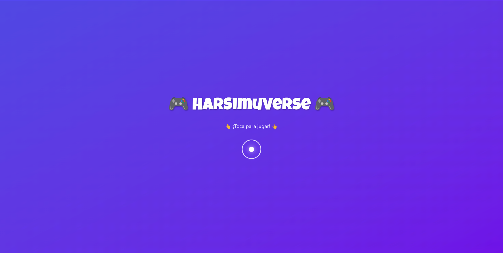
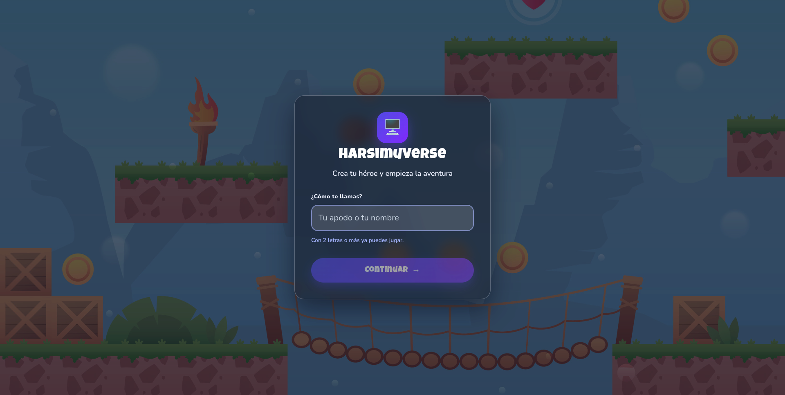
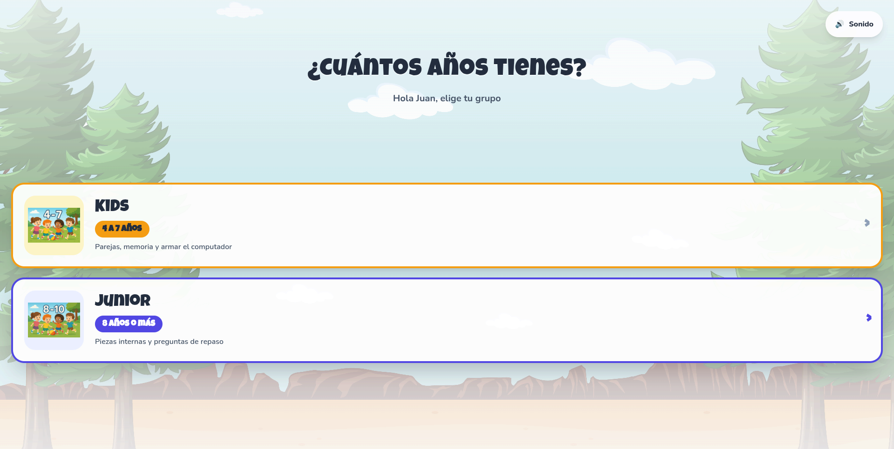
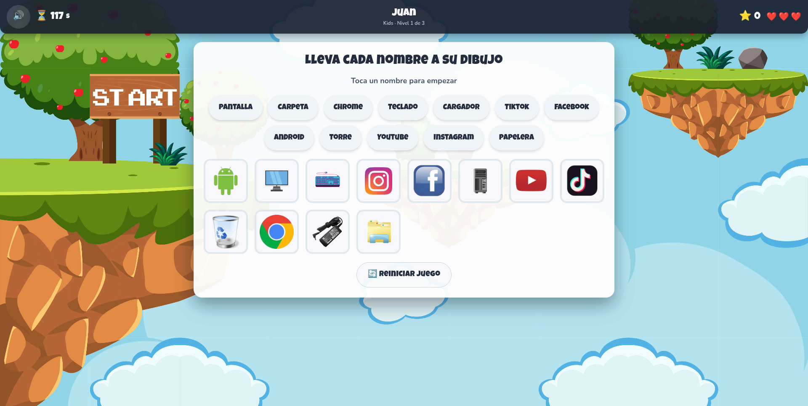
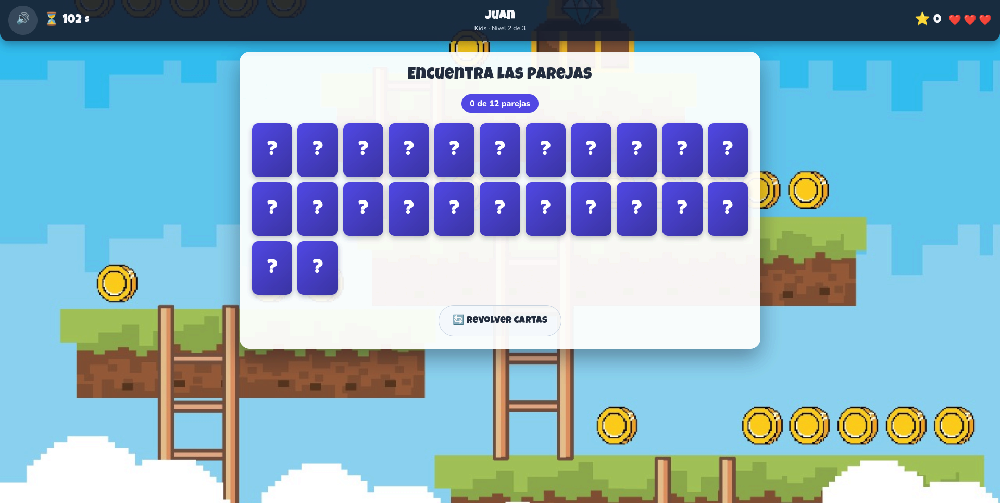
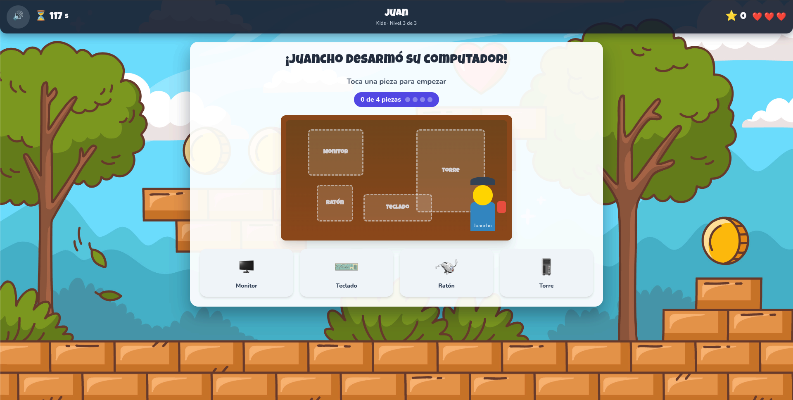
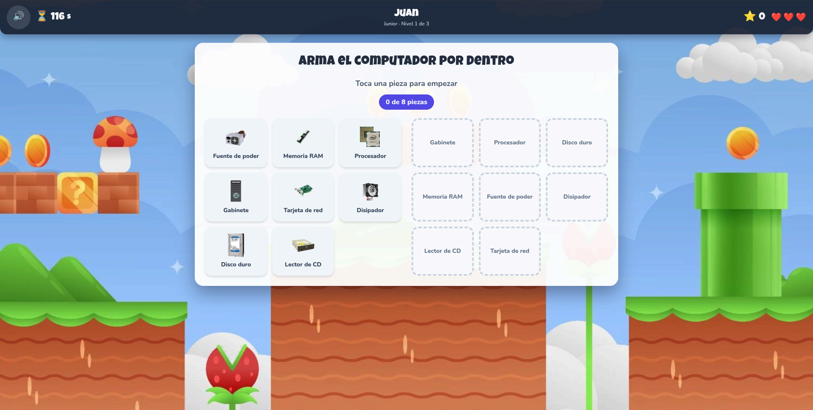
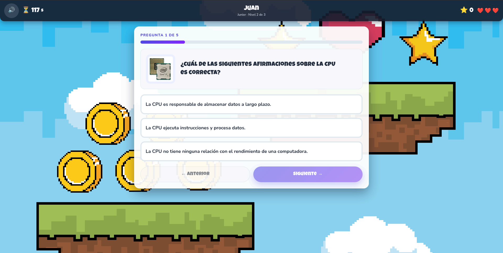
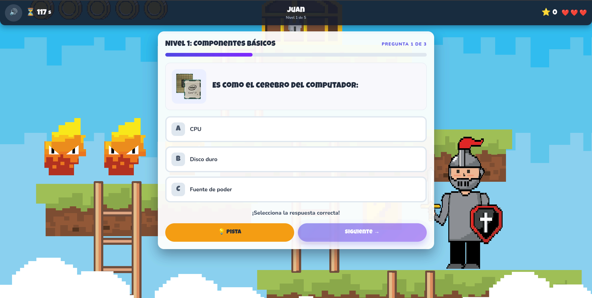
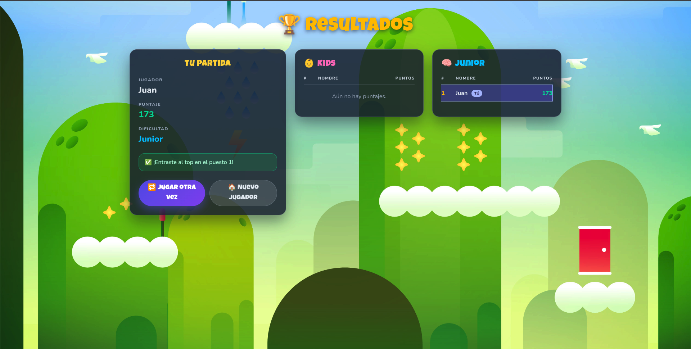

[← Volver al perfil](README.md)

# HarSimuVerse

Juego educativo sobre las partes del computador para niños de 4 a 12 años. Seis
minijuegos repartidos en dos dificultades enseñan a reconocer los componentes,
distinguir los internos de los externos y armar un equipo pieza por pieza.

No necesita servidor ni cuenta: se abre y se juega. Los puntajes quedan
guardados en el navegador.

**Stack:** Angular 19 + Tailwind 4 · SweetAlert2 · Docker

🔗 **[Jugar](https://har-simu-verse.vercel.app/home)**

---

# La aplicación

## Entrada



Antes de nada, una pantalla que solo pide un toque. No es decorativa: los
navegadores bloquean el audio hasta que el usuario interactúa con la página, así
que este toque es lo que habilita la música del juego. Sin él, la primera pista
sonaría a destiempo o no sonaría.

Es un botón real, no una imagen con un `click` encima, así que responde al
teclado y los lectores de pantalla lo anuncian.

## Crear el héroe



Solo pide un nombre. No hay cuentas, contraseñas ni correo — el usuario tiene
cuatro años y puede estar usando la tablet del salón.

Con dos letras basta para empezar, y el propio campo lo dice antes de que el
niño falle. Los espacios de sobra se recortan, de modo que `"  juan   perez  "`
queda como `"juan perez"` y el ranking muestra siempre el mismo nombre.

## Elegir la edad



Dos grupos, cada uno con su edad y con lo que va a encontrar dentro. Antes de
elegir ya se sabe que Kids trae parejas y armado, y Junior piezas internas y
preguntas.

Las dos opciones son botones con nombre accesible: se puede recorrer con el
tabulador y el anillo de foco se ve. El control de sonido lleva etiqueta, no un
ícono suelto, y mide 56 px de alto — por encima del mínimo táctil, porque quien
lo toca lo hace con el dedo.

---

## Kids · Nivel 1 — Cada nombre a su dibujo



Doce nombres arriba y doce dibujos abajo: pantalla, teclado, papelera, Chrome,
TikTok. La tarea es llevar cada palabra a su imagen.

Funciona de dos formas a la vez. Con el ratón se arrastra; en pantalla táctil se
toca el nombre y después el dibujo. Esto último importa: la API de arrastre de
HTML5 no existe en los navegadores móviles, así que en una tablet — que es el
dispositivo probable — solo el modo de toque funciona.

La instrucción sigue el estado en lugar de ser un cartel fijo: dice *"Toca un
nombre para empezar"* y cambia a *"Ahora toca el dibujo que le corresponde"* en
cuanto hay uno seleccionado. Los dibujos disponibles solo se resaltan mientras
hay un nombre en la mano; resaltarlos siempre convierte la pista en fondo.

## Kids · Nivel 2 — Encuentra las parejas



Un tablero de memoria con las doce piezas del computador, cada una repetida. Se
voltean de dos en dos y hay que recordar dónde estaba cada cual.

El tablero se acomoda solo al ancho de la pantalla, así que en una tablet
vertical no se sale por los lados. El botón *Revolver cartas* reparte de nuevo y
reinicia el contador de la ronda.

## Kids · Nivel 3 — Armar el computador



Juancho desarmó su computador y hay que devolverle cada pieza a su sitio:
monitor, teclado, ratón y torre sobre el escritorio.

Los huecos están posicionados en porcentajes sobre un contenedor con proporción
fija, de modo que el escritorio escala igual en cualquier pantalla sin que las
piezas se solapen. El contador muestra el avance con puntos, no solo con un
número.

---

## Junior · Nivel 1 — El computador por dentro



Ocho componentes internos — fuente de poder, RAM, procesador, disipador, tarjeta
de red, disco duro, lector de CD y gabinete — que van a su ranura correspondiente.

Los huecos aparecen en orden distinto al de las piezas, para que no se resuelva
por posición. Al colocar una correcta se marca en verde con un ✓; al fallar, la
ranura se sacude en rojo. Nunca solo por color: cada estado lleva además forma y
movimiento, de modo que un niño que no distinga rojo de verde lo entiende igual.

## Junior · Nivel 2 — Preguntas de repaso



Cinco preguntas de opción múltiple sobre lo que hace cada componente. Se puede
ir y volver entre ellas con *Anterior* y *Siguiente*, y las respuestas ya dadas
se conservan.

Al terminar aparece un resumen con cada pregunta, lo que se respondió y la
respuesta correcta cuando no coincide.

## Junior · Nivel 3 — Cinco niveles de preguntas



Quince preguntas repartidas en cinco niveles temáticos: componentes básicos,
internos, memoria y almacenamiento, entrada y salida, y avanzados.

Cada pregunta tiene una **pista** disponible antes de responder, y una
explicación que aparece después. La explicación es la parte educativa: no basta
con acertar, la idea es entender por qué. Mientras el aviso está abierto el reloj
se congela, para que leer no cueste segundos de partida.

---

## Resultados



Al terminar, el puntaje se registra y se muestra el puesto conseguido. A la
derecha, el top 5 de cada dificultad, con la fila propia marcada para no tener
que buscarse.

**Los puntajes son de este navegador.** No hay servidor, así que cada equipo
tiene su propia tabla: sirve para superarse a uno mismo o para competir entre
quienes usan la misma tablet, no para un ranking entre salones.

---

## Durante la partida

La barra superior acompaña los seis minijuegos:

| Elemento | Para qué |
|---|---|
| 🔊 Sonido | Silencia la música. La preferencia se recuerda entre sesiones |
| ⏳ Reloj | 120 segundos por ronda. Al bajar de 15 crece, se enmarca y late |
| Nombre y nivel | En qué dificultad y en qué nivel de tres va |
| ⭐ Puntaje | Acumulado de la partida |
| ❤️ Vidas | Tres. Los corazones perdidos se dibujan vacíos en vez de desaparecer |

Se queda fija arriba al hacer scroll, así que el reloj y las vidas nunca se
pierden de vista.

**Puntuación:** 10 puntos por pareja acertada, 15 por pieza colocada o pregunta
correcta, más un bono igual a los segundos que sobren al completar el nivel —
terminar rápido vale más.

**Vidas:** se pierde una por cada error y por cada ronda que se agote. Al
quedarse sin ninguna se puede reintentar el nivel o salir. Reintentar conserva
los puntos de los niveles ya superados.

---

# Detalles técnicos

## Arquitectura

```
Angular (SPA)  ──>  localStorage
```

Eso es todo. No hay backend, ni base de datos, ni peticiones de red: la
aplicación se sirve como archivos estáticos y todo el estado vive en el
navegador.

El proyecto **sí tuvo** un backend en Laravel + PostgreSQL para guardar los
puntajes. De sus seis rutas, solo dos hacían algo real. Ese servidor vivía en un
plan gratuito que se suspende por inactividad y tarda cerca de un minuto en
volver, con una cuota mensual que se agota si se mantiene despierto. Mover los
puntajes al navegador eliminó la capa entera — API, base, despliegue y sus
variables — a cambio de que el ranking dejara de ser compartido.

El código del backend sigue en `Backend/`, apagado tras un perfil de Docker
Compose, por si el ranking compartido vuelve a hacer falta.

## Estado de la partida

Dos almacenamientos distintos, con propósitos distintos:

| Dónde | Qué guarda | Cuánto dura |
|---|---|---|
| `sessionStorage` | Nombre, dificultad, vidas, puntaje de la partida en curso | La pestaña |
| `localStorage` | Ranking (top 5 por dificultad) y preferencia de sonido | Hasta limpiar el navegador |

La partida va en `sessionStorage` a propósito: un refresco accidental a mitad de
nivel no debe borrar el progreso, pero abrir el juego en otra pestaña sí debe
empezar de cero. El ranking va en `localStorage` porque tiene que sobrevivir al
cierre del navegador.

Al llegar a resultados, un flag `submitted` evita que refrescar la pantalla —o
volver con el botón atrás— registre la misma partida dos veces.

## Rutas

| Ruta | Pantalla | Protegida |
|---|---|---|
| `/home` | Crear el héroe | — |
| `/select-level` | Elegir dificultad | — |
| `/kids/level-1..3` | Nombres · Memoria · Armado | Requiere partida |
| `/junior/level-1..3` | Internas · Quiz · Quiz por niveles | Requiere partida |
| `/score` | Resultados y ranking | Requiere partida |

Las pantallas de juego están detrás de un guard: sin nombre y dificultad no se
entra. Sin él se podía abrir `/kids/level-3` por URL, jugar sin nombre y
terminar con un puntaje que no se registraba en ninguna tabla.

Todas se cargan con `loadComponent`, así que el bundle inicial no arrastra los
seis minijuegos —con sus preguntas, listas de piezas y estilos— solo para
mostrar el formulario del nombre.

## Estructura

```
HarSimuVerse/
├── Front/                          # Aplicación Angular
│   └── src/app/
│       ├── Components/
│       │   ├── Screens/            # Registro, selector, resultados
│       │   │   └── Game/           # Los seis minijuegos
│       │   └── Shared/             # Barra superior del juego
│       ├── Core/                   # Reloj, arrastre táctil, diálogos, guards
│       ├── Models/                 # Tipos del ranking
│       └── Services/               # Estado de la partida, puntajes, audio
├── Backend/                        # API Laravel (archivada, sin uso)
├── images/                         # Capturas del README
└── docker-compose.yml
```

Los `Core/` son los que evitan que cada minijuego reinvente lo mismo: el reloj
con pausa, el arrastre que funciona con dedo y con ratón, y los diálogos que
congelan el tiempo mientras están abiertos.

## Estilos

Todo sale de un tema único declarado en `src/styles.css` con `@theme` de
Tailwind: colores, tipografías, radios y áreas táctiles. Las pantallas consumen
utilidades, así que ninguna puede inventarse un color por su cuenta sin que se
note.

Las áreas táctiles son tokens con nombre —`min-h-tapbtn`, `min-h-piece`— y no
números sueltos. Los 44 px que se citan como mínimo son una referencia **para
adultos**; aquí los controles de juego suben a 56–64 px y las piezas
arrastrables a 116, porque quien juega tiene cuatro años y usa el dedo.

## Despliegue

El frontend se publica en Vercel. `Front/vercel.json` trae la configuración:
comando de build, directorio de salida, cache inmutable para los bundles con
hash y el rewrite de SPA — sin ese último, refrescar en `/kids/level-2`
devuelve 404.

En el panel solo hay que fijar **Root Directory** en `Front`. No hay variables
de entorno que configurar: sin servidor, no hay nada que apuntar.
